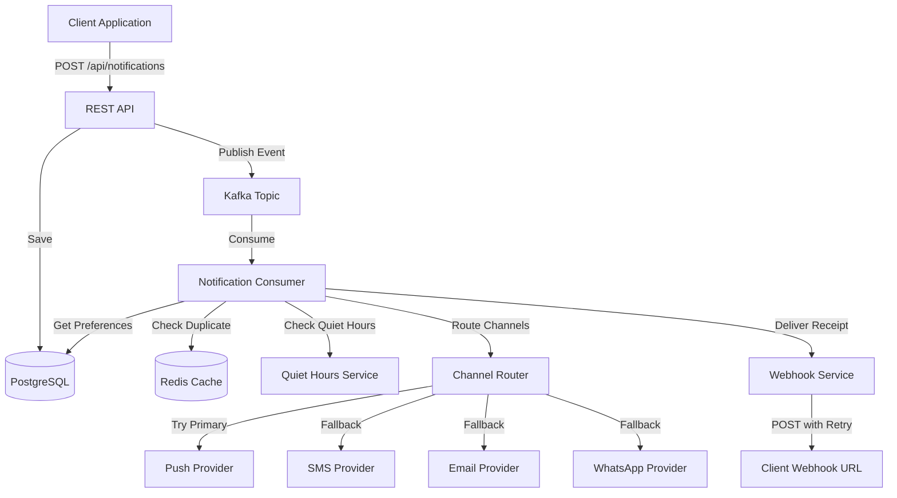
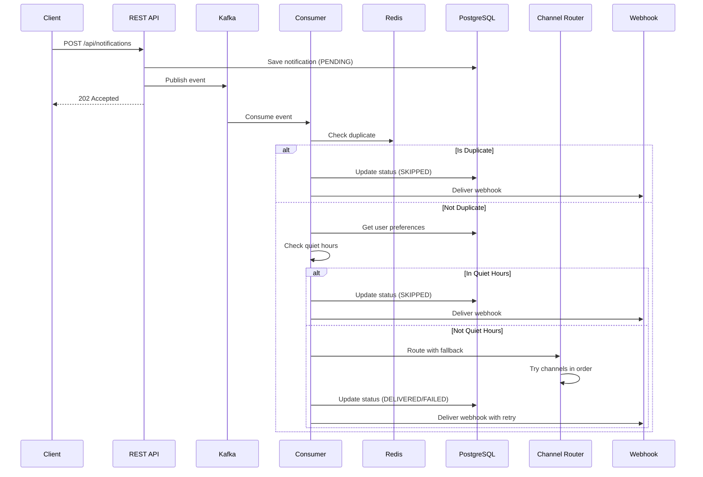
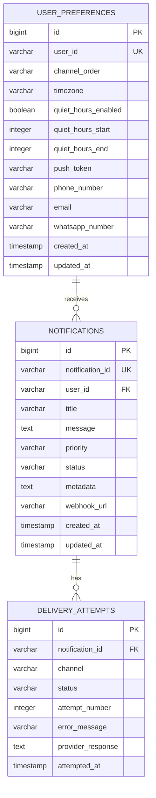

# Real-Time Notification Orchestration Engine

A production-grade multi-channel notification service handling delivery logic across Push, SMS, Email, and WhatsApp. Built with Spring Boot, Kafka, Redis, and PostgreSQL.

## Author

Chris Kinga Hinzano  
Email: hinzanno@gmail.com  
GitHub: github.com/Khin-96  
Website: hinzano.dev

## Overview

This notification engine implements the same patterns used by Safaricom for M-Pesa transaction alerts, providing intelligent channel routing, deduplication, fallback chains, and quiet hours enforcement.

## Architecture



## Key Features

### 1. Multi-Channel Routing
Resolves delivery order from user preferences stored in PostgreSQL. Supports Push, SMS, Email, and WhatsApp channels.

### 2. Redis-Based Deduplication
Prevents the same notification from being sent twice within a configurable time window (default: 5 minutes).

### 3. Intelligent Fallback Chain
If the primary channel fails, the service automatically retries on the next available channel in the user's preference order.

### 4. Quiet Hours Enforcement
Respects user timezone and quiet hours preferences. HIGH and CRITICAL priority notifications can bypass quiet hours.

### 5. Webhook Delivery with Exponential Backoff
Delivers delivery receipts to client endpoints using exponential backoff retry strategy:
- Immediate
- 1 minute
- 5 minutes
- 30 minutes
- 2 hours

### 6. Event-Driven Architecture
Decouples notification submission from delivery using Kafka, ensuring upstream services are never blocked by slow channel providers.

## Technology Stack

- Java 17
- Spring Boot 3.2.0
- Spring Data JPA
- Spring Kafka
- PostgreSQL 15
- Redis 7
- Apache Kafka 7.5
- Flyway (Database Migrations)
- Swagger/OpenAPI 3.0
- Docker & Docker Compose

## Notification Flow



## Database Schema



## API Endpoints

### Send Notification
```http
POST /api/notifications
Content-Type: application/json

{
  "userId": "user123",
  "title": "Payment Received",
  "message": "You have received KES 5,000 from John Doe",
  "priority": "HIGH",
  "metadata": {
    "transactionId": "TXN123456",
    "amount": 5000
  },
  "webhookUrl": "https://client.com/webhooks/notifications"
}
```

### Create/Update User Preferences
```http
POST /api/preferences
Content-Type: application/json

{
  "userId": "user123",
  "channelOrder": ["PUSH", "SMS", "EMAIL", "WHATSAPP"],
  "timezone": "Africa/Nairobi",
  "quietHoursEnabled": true,
  "quietHoursStart": 22,
  "quietHoursEnd": 7,
  "pushToken": "fcm_token_here",
  "phoneNumber": "+254704373903",
  "email": "user@example.com",
  "whatsappNumber": "+254704373903"
}
```

### Get User Preferences
```http
GET /api/preferences/{userId}
```

## Configuration

Key configuration properties in `application.yml`:

```yaml
notification:
  deduplication:
    window-seconds: 300
  retry:
    max-attempts: 5
    backoff-delays: 0,60,300,1800,7200
  quiet-hours:
    enabled: true
    start-hour: 22
    end-hour: 7
  webhook:
    timeout-seconds: 10
    max-retries: 5
```

## Running the Application

### Prerequisites
- Java 17 or higher
- Docker and Docker Compose

### Start Infrastructure
```bash
docker-compose up -d
```

This starts:
- PostgreSQL on port 5432
- Redis on port 6379
- Zookeeper on port 2181
- Kafka on port 9092

### Build and Run
```bash
./gradlew clean build
./gradlew bootRun
```

The application will start on port 8083.

### Access Swagger UI
```
http://localhost:8083/swagger-ui.html
```

### Health Check
```
http://localhost:8083/actuator/health
```

## Testing

Run all tests:
```bash
./gradlew test
```

## Channel Provider Integration

The service includes mock implementations for all channel providers. In production, integrate with:

- Push: Firebase Cloud Messaging (FCM), Apple Push Notification Service (APNs), OneSignal
- SMS: Twilio, Africa's Talking, AWS SNS
- Email: SendGrid, AWS SES, Mailgun
- WhatsApp: Twilio WhatsApp API, Meta WhatsApp Business API

## Monitoring

The application exposes Prometheus metrics at:
```
http://localhost:8083/actuator/prometheus
```

Key metrics to monitor:
- Notification delivery success rate by channel
- Average delivery time
- Deduplication hit rate
- Quiet hours skip rate
- Webhook delivery success rate

## Production Considerations

1. Implement Dead Letter Queue (DLQ) for failed Kafka messages
2. Add circuit breakers for channel provider calls
3. Implement rate limiting per user
4. Add distributed tracing with Zipkin/Jaeger
5. Configure Kafka with multiple replicas
6. Set up Redis Sentinel for high availability
7. Implement proper secrets management
8. Add comprehensive logging and alerting

## License

This project is part of a portfolio demonstrating production-grade backend development skills.
